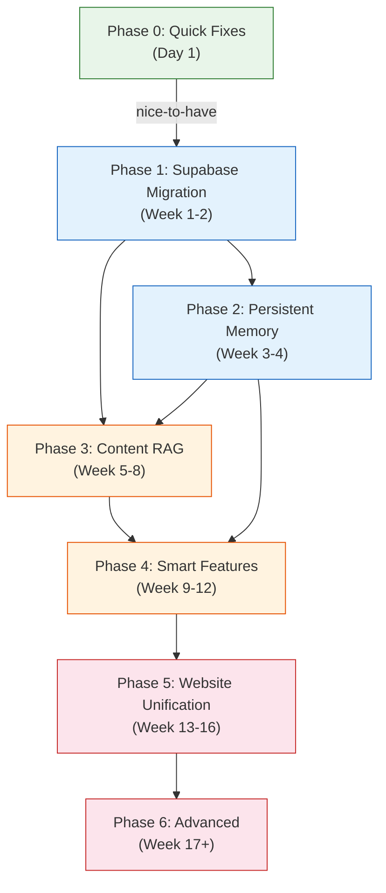

# ASK AI Platform - Master Plan Overview

## Vision

Transform ASK AI from a Telegram file-serving bot into a memory-enabled, RAG-powered educational platform for 2,870+ CBSE students across Classes 10-12 (AI, CS, IT, IP).

---

## Phase Dependency Graph

---

## Timeline

| Phase | Scope | Duration | Dependencies | Status |
|-------|-------|----------|--------------|--------|
| **Phase 0** | Quick Fixes (is_admin, onboarding, profile defaults) | Day 1 | None | Not started |
| **Phase 1** | Supabase Migration (Google Sheets → PostgreSQL) | Week 1-2 | None (P0 nice-to-have) | Not started |
| **Phase 2** | Persistent Memory (Mem0 + pgvector) | Week 3-4 | Phase 1 | Not started |
| **Phase 3** | Content RAG (Gemini parsing + embeddings + doubt solving) | Week 5-8 | Phase 1, Phase 2 | Not started |
| **Phase 4** | Smart Features (board prep, quiz, study planner, video notes) | Week 9-12 | Phase 3, Phase 2 | Not started |
| **Phase 5** | Website Unification (academy-platform merge, admin dashboard) | Week 13-16 | Phase 4 | Not started |
| **Phase 6** | Advanced (spaced repetition, progress tracking, multi-platform) | Week 17+ | Phase 5 | Not started |

---

## Current State vs Target State

| Dimension | Current State | Target State |
|-----------|--------------|--------------|
| **Database** | Google Sheets (rate-limited, slow) | Supabase PostgreSQL (fast, queryable) |
| **Memory** | In-memory dict (lost on restart) | Mem0 + Supabase pgvector (persistent) |
| **LLM** | GPT-4o for everything | GPT-4o for doubts, Gemini 2.5 Flash (free) for simple tasks |
| **Content** | File-serving only (PDFs from Drive) | RAG-powered: search inside PDFs, answer from content |
| **Embeddings** | None | gemini-embedding-001 (free, 3072 dims, MRL to 768) |
| **Onboarding** | 42% never set class/subject | Mandatory onboarding after /start |
| **"Please specify" rate** | 14% of all responses | Under 3% |
| **Platforms** | Telegram only | Telegram + Website + Discord |
| **Student experience** | File server with chat wrapper | Personalized AI tutor with memory |

---

## Success Metrics by Phase

| Phase | Key Metric | Baseline | Target |
|-------|-----------|----------|--------|
| **Phase 0** | "Please specify class/subject" rate | 14% | < 3% |
| **Phase 0** | Users with complete profiles | 58% | > 85% |
| **Phase 1** | API response latency (p95) | ~2s (Sheets) | < 500ms |
| **Phase 1** | Data loss incidents | Occasional Sheets errors | Zero |
| **Phase 2** | Repeat context requests per user | ~3/session | < 1/session |
| **Phase 2** | Session continuity (user returns, bot remembers) | 0% | 100% |
| **Phase 3** | "Can't find content" rate | 14% | < 5% |
| **Phase 3** | Explanation requests (vs file requests) | 3% | > 20% |
| **Phase 4** | Daily active features per user | 1.2 (notes only) | 3+ |
| **Phase 5** | Cross-platform users | 0 | > 500 |
| **Phase 6** | 30-day retention | 83% | > 90% |

---

## How to Use This Plan System

### Auto-Context
The `.cursor/rules/ask-ai-project.mdc` workspace rule is auto-loaded in every Cursor session. It contains the full project context, architecture overview, file map, and development conventions. You never need to manually reference it.

### Full Research
`V0-PROJECT-BIBLE.md` in the repo root contains the comprehensive research document: academic papers, EdTech analysis, technology decisions, student persona analysis, and architecture rationale. Reference it when making strategic decisions.

### Execution
Each phase has its own spec document in this directory:
- `01-phase-0-quick-fixes.md` — Day 1 fixes, no new tech
- `02-phase-1-supabase-migration.md` — Database migration with full schema
- `03-phase-2-memory-layer.md` — Persistent memory with Mem0
- Future: `04-phase-3-content-rag.md`, `05-phase-4-smart-features.md`, etc.

### Workflow
1. Read the phase doc before starting work
2. Follow acceptance criteria as a checklist
3. Modify only the files listed in "Files to modify"
4. Test locally via `./start_devtest.sh`
5. Deploy via `./deploy.sh` to Cloud Run
6. Update the status in this overview after completing each phase
