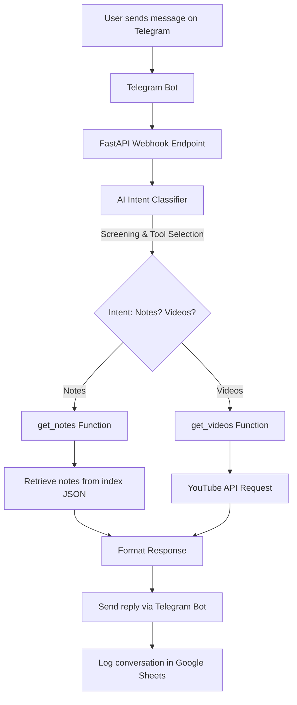
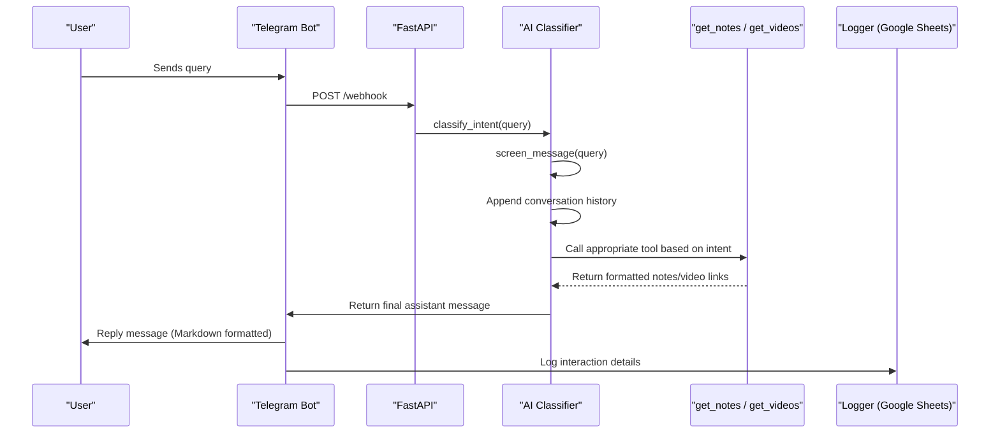

# Akask.ai: AI-Powered Educational Assistant

**Akask.ai** is a Telegram-based AI assistant designed to support students by providing class notes, video links, and answering educational queries. It integrates multiple services including FastAPI for the web server, Telegram for user interaction, Google Sheets for logging, Google APIs for spreadsheet access, and OpenAI’s models for natural language understanding and content generation.

---

## Table of Contents

- [Overview](#overview)
- [Features](#features)
- [Architecture](#architecture)
- [Technical Details](#technical-details)
  - [Components](#components)
  - [Flow Diagrams](#flow-diagrams)
- [Installation and Setup](#installation-and-setup)
- [Environment Variables](#environment-variables)
- [Usage](#usage)
- [Contributing](#contributing)
- [License](#license)

---

## Overview

Akask.ai serves as a digital study buddy that:
- Processes user messages via Telegram.
- Screens messages for inappropriate content.
- Classifies intent and responds using predefined tools for retrieving notes or video links.
- Logs each interaction into a Google Sheet for auditing and analysis.
- Utilizes asynchronous programming to handle API calls and external service integrations effectively.

The system is built on Python and leverages asynchronous frameworks and API clients to ensure scalability and responsiveness.

---

## Features

- **Telegram Bot Integration:** Receives and responds to student queries via Telegram.
- **AI-Powered Intent Classification:** Uses OpenAI models to understand and process user queries.
- **Content Screening:** Filters out inappropriate content using a specialized screening function.
- **Dynamic Tool Invocation:** Calls dedicated functions (`get_notes` and `get_videos`) based on the user’s intent.
- **Google Sheets Logging:** Records user queries and responses with timestamps.
- **Asynchronous Execution:** Utilizes `asyncio` and `uvicorn` with FastAPI for non-blocking I/O operations.
- **YouTube API Integration:** Retrieves video data from YouTube for additional educational content.

---

## Architecture

The system consists of several integrated components that work together to deliver a seamless experience.

### Components

1. **Telegram Bot Application:**
   - Listens for incoming messages and commands.
   - Uses the Telegram API to send responses.

2. **FastAPI Web Server:**
   - Exposes endpoints (including a webhook endpoint) to receive and process updates.
   - Manages lifecycle events, such as setting up webhooks on deployment.

3. **AI Intent Classifier:**
   - Screens user inputs.
   - Classifies intent to decide if the query relates to notes or videos.
   - Routes the request to the corresponding function.

4. **External API Integrations:**
   - **Google Sheets & gspread:** Logs conversation details.
   - **Google API Client:** Opens and accesses the specified Google Spreadsheet.
   - **YouTube API:** Searches and retrieves video details.
   - **OpenAI API:** Generates responses and assists in content screening.

### Flow Diagrams

Below are two Mermaid diagrams illustrating the overall system architecture and the internal query processing flow.

#### System Architecture


#### Internal Query Processing Flow



## Technical Details

### Components

- **FastAPI Application:**  
  The server is created with FastAPI, leveraging an asynchronous lifespan context to set up webhooks upon startup.

- **Telegram Bot Handlers:**  
  Commands (`/start`) and message handlers are defined to interact with users. The bot uses the Telegram API client to handle message updates.

- **Intent Classification:**  
  - **Screening:** The `screen_message` function sends the query to OpenAI’s GPT model to check for content appropriateness.
  - **Intent Routing:** The `classify_intent` function uses conversation history and predefined tools to determine if the query should fetch notes or videos.

- **Tool Functions:**
  - **get_notes:** Reads a local JSON index file and returns a Markdown formatted list of notes.
  - **get_videos:** Uses the YouTube API to search for relevant videos and formats them as Markdown links.

- **Logging:**  
  Every interaction is logged into a Google Sheet using the gspread library, ensuring a persistent record of queries and responses.

### Asynchronous Execution

The entire system uses asynchronous patterns (`asyncio`, `await`, and FastAPI’s async routes) to ensure that API calls (such as to YouTube and OpenAI) do not block the main event loop. This design enables the application to scale and handle multiple simultaneous requests efficiently.

---

## Installation and Setup

### Prerequisites

- **Python 3.8+**
- **Virtual Environment** (recommended)
- **Google Cloud Service Account** with access to Google Sheets
- **Telegram Bot Token** from BotFather
- **API Keys:** OpenAI API, YouTube API
- **NGROK/CLOUD_RUN URL** for webhook configuration

### Steps

1. **Clone the Repository:**

    ```bash
    git clone https://github.com/yourusername/akask-ai.git
    cd akask-ai
    ```

2. **Create and Activate a Virtual Environment:**

    ```bash
    python3 -m venv venv
    source venv/bin/activate  # On Windows: venv\Scripts\activate
    ```

3. **Install Dependencies:**

    ```bash
    pip install -r requirements.txt
    ```

4. **Set Up Environment Variables:**

    Create a `.env` file in the root directory with the following variables:

    ```env
    TELEGRAM_BOT_TOKEN=your_telegram_bot_token
    NGROK_URL=your_ngrok_url
    OPENAI_API_KEY=your_openai_api_key
    YOUTUBE_API_KEY=your_youtube_api_key
    CLOUD_RUN_URL=your_cloud_run_url  # Optional: used for setting webhooks automatically
    ```

5. **Run the Application:**

    ```bash
    uvicorn main:app --host 0.0.0.0 --port 8080
    ```

6. **Set Up Webhook (if not auto-configured):**

    Use the following cURL command (replace placeholders):

    ```bash
    curl -X POST "https://api.telegram.org/bot<YOUR_BOT_TOKEN>/setWebhook" \
         -H "Content-Type: application/json" \
         -d '{"url": "https://<your-cloud-run-url>/webhook"}'
    ```

---

## Environment Variables

The application requires several environment variables for proper operation:

- **TELEGRAM_BOT_TOKEN:** Telegram API token for your bot.
- **NGROK_URL:** Public URL provided by ngrok (for local development).
- **OPENAI_API_KEY:** API key for accessing OpenAI services.
- **YOUTUBE_API_KEY:** API key for YouTube Data API.
- **CLOUD_RUN_URL:** (Optional) URL for deployment on Cloud Run which is used for webhook setup.

Ensure these are defined in your `.env` file or your deployment environment.

---

## Usage

Once the application is running and the webhook is set, interact with the bot on Telegram:

- **Start:** Use the `/start` command to initiate a conversation.
- **Query:** Send any query regarding class notes or educational videos. The bot will:
  - Screen your query for appropriateness.
  - Classify the intent.
  - Invoke the proper tool (`get_notes` or `get_videos`) to retrieve and format the requested data.
  - Reply in MarkdownV2 format.

All interactions are logged in a designated Google Sheet for further review.

---

## Contributing

Contributions are welcome. Please follow these guidelines:
- Fork the repository and create a new branch for your feature or bug fix.
- Ensure your code follows the project's asynchronous and modular design patterns.
- Update documentation and tests as needed.
- Submit a pull request for review.

---

## License

This project is licensed under the MIT License.

---

*This README provides a technical walkthrough of the Akask.ai codebase. The design emphasizes asynchronous programming, modular architecture, and seamless integration with multiple external APIs, ensuring both reliability and scalability for an educational assistant application.*

