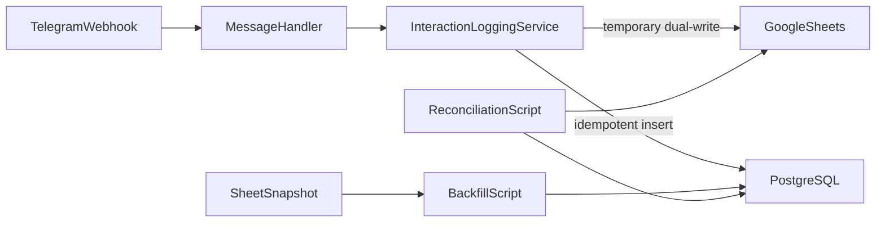

# Google Sheets to PostgreSQL Migration Plan

## Recommendation and scope

Use **Supabase PostgreSQL in Mumbai** and keep provider-specific details behind
`DATABASE_URL`. This matches the accepted Supabase and Mem0/pgvector decisions
in `DECISIONS.md`, supports the future platform architecture, and avoids
redesigning later phases.

Phase 1 migrates the append-only interaction log before attempting profiles,
notes, warnings, content indexes, or conversation history.

## Database options and verified pricing

Pricing and limits were checked against official vendor pages on September 19,
2026.

- **Supabase Free — selected for migration and dual-write:** $0/month, 500 MB
  database, 5 GB egress, Mumbai region, shared Supavisor connection pooling,
  and pgvector support. It has no automatic backups and inactive projects can
  pause after one week, so use it while Sheets remains a recoverable second
  copy. Sources: [pricing](https://supabase.com/pricing),
  [regions](https://supabase.com/docs/guides/platform/regions),
  [pooling](https://supabase.com/docs/guides/database/connecting-to-postgres),
  and [backups](https://supabase.com/docs/guides/platform/backups).
- **Supabase Pro — selected production target:** $25/month for the
  organization, with one Micro compute instance effectively covered by the
  included $10 compute credit, 8 GB database storage, 250 GB egress, and daily
  backups retained for seven days. Upgrade before Sheets is retired as the
  fallback. Source: [Supabase pricing](https://supabase.com/pricing).
- **Neon Free/Launch — best cost-focused alternative:** Free provides 0.5 GB
  storage, 100 CU-hours per project, 5 GB egress, a six-hour restore history,
  pooled connections, pgvector, and scale-to-zero after five idle minutes.
  Launch is usage-based at $0.106/CU-hour plus $0.35/GB-month storage, with up
  to seven days of history. Its closest current region is Singapore rather than
  Mumbai. Sources: [pricing](https://neon.com/pricing),
  [regions](https://neon.com/docs/introduction/regions),
  [pooling](https://neon.com/docs/connect/connection-pooling), and
  [pgvector](https://neon.com/docs/extensions/pgvector).
- **Google Cloud SQL for PostgreSQL — best GCP-native alternative:** integrates
  directly with GCP IAM and offers Mumbai and Delhi regions. Google's published
  test example is $9.37/month in `us-central1` for shared CPU, 0.6 GB RAM, and
  the 10 GB minimum storage, excluding backups, HA, and outbound transfer.
  Exact Mumbai pricing must be checked in the calculator. Shared-core instances
  have no Cloud SQL SLA. Sources:
  [pricing](https://cloud.google.com/sql/pricing),
  [pricing example](https://cloud.google.com/sql/docs/postgres/pricing-examples),
  [regions](https://cloud.google.com/sql/docs/postgres/locations), and
  [pgvector support](https://docs.cloud.google.com/sql/docs/postgres/extensions).
- **Railway Hobby — inexpensive but not preferred:** $5/month minimum including
  $5 of usage; additional RAM, CPU, persistent volume, and egress are metered.
  Source: [Railway pricing](https://railway.com/pricing).
- **SQLite:** useful only for exercises or local tests. Do not deploy it on
  Cloud Run because container files are ephemeral and not shared.
- **Self-hosted PostgreSQL:** avoid for this project because backups, patching,
  monitoring, and failover would become application responsibilities.

### Final choice

- Start with **Supabase Free in Mumbai** for schema creation, tests, backfill,
  and temporary dual-write.
- Measure database size, p50/p95 query latency, database errors, and pool usage
  during a 3–7 day validation window.
- Upgrade to **Supabase Pro before PostgreSQL becomes the sole source of truth**
  unless tested automated `pg_dump` backups to separate storage are
  deliberately accepted instead.
- Use Supabase's pooled runtime connection from Cloud Run and a direct
  connection only for Alembic migrations and administrative jobs.
- Keep **SQLAlchemy async + asyncpg** and **Alembic** so the application remains
  portable to Neon or Cloud SQL through `DATABASE_URL`.

## Target flow

## 1. Define the data contract

Model one immutable `InteractionEvent`, matching the seven current Sheet values
and adding:

- `event_id UUID`, generated once before either write
- `telegram_update_id BIGINT` for deduplicating Telegram retries
- timezone-aware `occurred_at TIMESTAMPTZ`
- `source_ref TEXT` for idempotent historical imports
- the original raw Sheet timestamp
- `created_at TIMESTAMPTZ`

Preserve screener, intent, and entities as `TEXT` initially because the current
application does not guarantee valid JSON. Raw messages and Telegram IDs are
personal data: restrict credentials, require TLS, avoid message bodies in
application logs, and enforce a retention period.

## 2. Add the database foundation

- Use SQLAlchemy async, asyncpg, and Alembic.
- Validate `DATABASE_URL`, `INTERACTION_LOG_MODE`, pool limits, and write
  timeout from environment variables.
- Create one async engine per process with health checks and clean shutdown.
- Create `interaction_events` with unique event, Telegram update, and source
  identifiers plus indexes on occurrence time and Telegram user ID.
- Use PostgreSQL locally and in integration tests rather than treating SQLite
  as equivalent.

## 3. Add temporary dual-write

- Implement an async `InteractionRepository` boundary.
- Implement PostgreSQL and Google Sheets repositories.
- Run synchronous gspread calls outside the async event loop.
- Generate one event and pass the same UUID to both stores.
- Append `Event ID` as the eighth Sheet column during dual-write.
- Keep logging fail-open so persistence failures cannot break student replies.
- Do not attempt a transaction across Sheets and PostgreSQL. Use idempotency,
  bounded retries, and reconciliation instead.

## 4. Build the safety net

- Test `sheet`, `dual`, `postgres`, and `off` modes.
- Test single-sink failure isolation and handler fail-open behavior.
- Test schema creation, insert, duplicate IDs, Unicode/long text, optional
  outputs, connection failure, and startup readiness.
- Require an actual disposable PostgreSQL database for online integration
  coverage.

## 5. Deploy dual-write and backfill

- Export and checksum the Sheet before changing it and record the highest
  existing row.
- Apply Alembic to non-production before production.
- Deploy in `dual` mode and verify the same event ID appears in both stores.
- Validate and import historical rows in bounded batches.
- Preserve rejected rows in a review file instead of dropping them.
- Make reruns idempotent.

## 6. Reconcile and cut over

Reconciliation must compare:

- historical export count versus imported and explicitly rejected rows
- every dual-written event ID in both stores
- hashes of all seven payload fields
- database write failures and latency from application logs

Keep dual-write for a representative 3–7 day window. Cut over only after exact
accounting, payload parity, stable peak-hour behavior, and a successful
backup/restore drill. Retain feature-flag rollback to Sheets for at least 72
hours after switching to PostgreSQL-only.

## 7. Follow-on work

Profiles, notes, warnings, content indexes, folders, moderation logs, Drive sync
logs, and conversation memory remain separate migrations. Remove gspread from
the runtime only after each of those dependencies has a PostgreSQL replacement.

If interaction logs become guaranteed-delivery business data, introduce a
durable queue such as Pub/Sub. Direct fail-open writes are suitable for optional
analytics, not a no-loss event ledger.

## Current status

Completed:

- Interaction contract and Alembic schema
- Async database and repository infrastructure
- Feature-flagged logging service
- Migration-focused unit and integration test suite
- Restartable backfill and payload reconciliation tooling
- Operational runbook in `docs/INTERACTION_LOGGING.md`

Pending:

- Supabase project and database URL configuration
- Online PostgreSQL integration tests
- Non-production and production Alembic application
- Live dual-write, backfill, reconciliation, and restore drill
- PostgreSQL-only cutover and eventual Sheets cleanup

## Concepts

- **Schema migration:** a reviewed, versioned database change applied by
  Alembic.
- **Repository boundary:** application code depends on an interface, not a
  vendor SDK.
- **Idempotency:** an event or import can be retried without duplicates.
- **Backfill:** copying historical rows after the new write path exists.
- **Dual-write:** temporarily writing new events to old and new stores.
- **Reconciliation:** proving payloads match before cutover.
- **Rollback:** changing a feature flag back without destroying new data.
